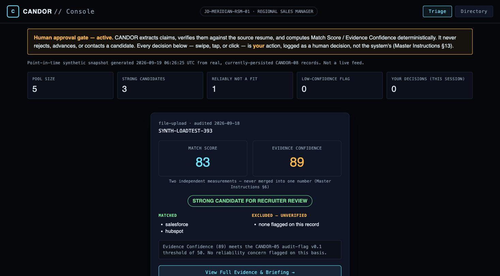
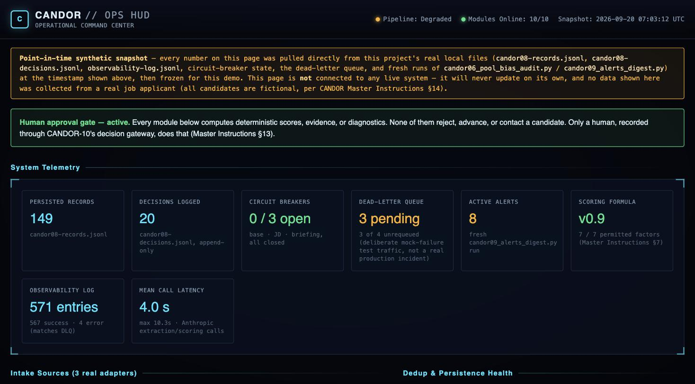

# CANDOR

An AI-assisted candidate-screening pipeline that extracts claims from a resume, verifies them against the source text, computes a deterministic Match Score and a separately-tracked Evidence Confidence score, and stops — every decision to advance, hold, or reject a candidate is made and logged by a human, never by the system. Built as a 10-module pipeline on n8n, with Claude (Anthropic API) doing extraction, verification, and recruiter-briefing generation.

This isn't a single automation — it's a pipeline built with the same engineering discipline you'd expect from production hiring software: deterministic (code-computed, not LLM-invented) scoring, a documented set of permitted scoring factors with an explicit exclusion list for protected attributes, real concurrency and load testing against the live instance, and a hard human-approval gate that the UI itself keeps visible at all times, not a checkbox buried in settings.

CANDOR is a sibling project to [n8n Opportunity Radar](https://github.com/autodydac/n8n-opportunity-radar), applying the same evidence-verification / deterministic-scoring / human-approval-gate architecture to a different, higher-stakes domain: employment screening.

## What it does

1. **Intake** — a candidate's resume reaches the pipeline through one of three real source adapters: direct file upload, a structured application-submission form, or a batch ATS-export file (JSON, one record per candidate, mixed shapes supported in the same batch).
2. **Extract** — Claude reads the resume and pulls out structured claims (years of experience, skills, employment history, education, certifications, portfolio/work samples), instructed to report "insufficient information" rather than guess, and to quote the exact source sentence backing each claim.
3. **Verify** — every extracted claim is checked against the source text before it can be trusted downstream; claims that can't be verified are marked as such, not silently dropped.
4. **Score** — a deterministic, code-computed **Match Score** (0-100) from up to 7 permitted factors (years of experience, required-skill overlap, role-tenure stability, career trajectory, education/certification match, portfolio/work-sample match — each domain-gated so it's only scored when the job posting actually requires it), plus a separately-computed **Evidence Confidence** score measuring how much of that score rests on independently-verified claims. These two numbers are never merged into one — CANDOR's own interface enforces that they're always shown side by side.
5. **Audit** — every scored record carries its own audit trail: which fields were used in scoring, which protected/personal fields were present but deliberately excluded, and an empirical check for whether an excluded field's value ever leaked into what was actually scored.
6. **Aggregate** — pool-level statistics, a qualification-profile clustering pass ("a legible map of the pool, not a black-box leaderboard"), and a bias-audit report on required-skill match rates across the pool.
7. **Brief** — a plain-English, single-candidate briefing generated by Claude Sonnet, under 5 hard constraints (no recommendation, however indirect; both scores always shown together; the reliability caveat is prominent when evidence confidence is low; every claim traceable to the record) — and checked by a second, independent Claude call reviewing the briefing against those same constraints before it's shown to a human.
8. **Gate** — a two-page human-approval workflow: page 1 pulls up a candidate's real, freshly-generated briefing; page 2 records a human decision (ADVANCE / REJECT / HOLD — MORE INFO NEEDED). The system never executes that decision — it only records it, append-only, so a changed mind is a new record, never an overwrite.

## Interfaces

Two operator-facing interfaces, both static HTML/CSS/JS (no backend, no live connection to n8n) embedding a frozen, labeled, point-in-time data snapshot pulled from this project's own real files.

### Candidate Console
Recruiter-facing workspace with two modes: a swipeable Triage stack and a searchable Directory. Match Score and Evidence Confidence are always shown as two separate numbers. Reviewing full evidence — factor-level breakdown, matched/uncertain requirements, the protected-field exclusion check, the real recruiter briefing, and decision history — is required before any decision button unlocks.

### Ops HUD
Operational command center: pipeline/module health, intake volume by source adapter, dedup and near-duplicate catch rates, circuit-breaker and dead-letter-queue state, decision activity, active alerts, and the pool-level bias audit — every panel backed by a real number from this project's own files, nothing invented.

Open either file directly in a browser (`interfaces/candor-candidate-console.html`, `interfaces/candor-ops-hud.html`) — no server, build step, or dependency required.

## Engineering practices worth noting

- **Verified, not assumed.** A green "success" indicator in the workflow UI was never treated as proof of a correct result throughout this build — every module was checked against raw output (disk reads, the SQLite execution database, independent hash recomputation), not the UI's execution log alone.
- **Real concurrency testing, not just sequential.** 86 real form submissions across 3 batches (up to 50 fully concurrent) proved the dedup gate and append-only write path hold under real load: zero corruption, zero circuit-breaker trips, zero failures. A separate 15-way concurrent test proved the human-approval gateway's session mechanism and append-only decision log hold too — and surfaced a real n8n platform-behavior finding along the way (a single held-open connection doesn't reliably receive a multi-page form's async result; short polling does). Full results in [`docs/LOAD-AND-CONCURRENCY-TESTING.md`](docs/LOAD-AND-CONCURRENCY-TESTING.md).
- **A documented, enforced exclusion list.** Protected/personal fields (name, contact info, prior job title, prior employer) are never permitted scoring inputs. Every scored record includes an empirical check for whether an excluded field's value leaked into what was actually computed — and when that check found a real (believed false-positive) hit during this build, it was surfaced transparently in the interface rather than quietly special-cased away.
- **Cost governance.** Claude Haiku handles high-volume extraction; Claude Sonnet is reserved for the one step (recruiter briefing) where phrasing nuance justifies the cost. Real measured cost: ≈$0.0106/candidate for intake+scoring, ≈$0.008/candidate for a briefing. A real architectural inefficiency (the job posting gets re-extracted on every submission, not cached) was found, quantified (43% of load-test spend), and documented as a known, deferred fix rather than silently left unmentioned.
- **Human-in-the-loop by design, not by convention.** No module in this pipeline is capable of rejecting, advancing, or contacting a candidate. The interface says so in a banner that's always visible, not a footnote.

## Tech stack

- **n8n** (self-hosted via Docker) — orchestration
- **Claude** via the Anthropic API (Haiku for extraction, Sonnet for briefings) — extraction, verification input, and recruiter-briefing generation
- **Python** (stdlib only, no dependencies) — pool-level statistics, bias audit, and clustering scripts; real regression-check scripts wired into a git pre-commit hook
- **Plain HTML/CSS/JS** — both interfaces, no framework, no build step

## Setup / demo instructions

The two interfaces under `/interfaces` are fully self-contained — open either `.html` file directly in a browser. They embed a synthetic data snapshot and never call out to any backend.

`/workflows` contains real, sanitized n8n workflow exports for 3 of the pipeline's most representative modules — the 3-adapter source intake (CANDOR-02), the deterministic scoring engine (CANDOR-04, the largest and most detailed of the three), and the human-approval gateway (CANDOR-10). These are genuine exports of the live workflows, not illustrative mockups — real node names, real connections, real Code-node JavaScript. Credential references and the builder's name have been stripped (each file's own `_export_meta` says so); everything else is real. Importing one into your own n8n instance will need a real Anthropic credential wired back in under the same credential name the nodes reference.

Reproducing the full 10-module pipeline requires your own n8n instance (Community Edition, self-hosted) and an Anthropic API key; see [`docs/ARCHITECTURE.md`](docs/ARCHITECTURE.md) for how the modules not included here fit together. No credential IDs or internal infrastructure details (container paths, internal ports) are included anywhere in this repo (see Security & Privacy below).

## Security & privacy design

- **No real candidate data anywhere in this repo or in either interface.** Every candidate, resume, and job description used in development and testing is explicitly fictional, marked as such in the source text itself, and stated as such in both interfaces' own footers.
- **No live connection.** Neither interface calls out to n8n or any other backend — both embed a frozen, labeled, point-in-time snapshot.
- **No credentials in code.** Real deployment credentials (API keys, form auth) are read from environment configuration, never hardcoded, and never committed — verified by a real secret scan of this repo's history before publication.
- **Deliberate scope limits.** The pipeline computes scores and diagnostics; it never executes a hiring action. This mirrors the same regulated/high-risk-domain discipline the sibling UOR project applies to its own execution-capable steps, applied here because employment screening is explicitly a regulated, high-risk category.

Full detail in [`docs/SECURITY-AND-PRIVACY.md`](docs/SECURITY-AND-PRIVACY.md).

## What's not included / known limitations

- **Disparate-impact analysis by protected characteristic is structurally impossible, by design** — CANDOR never collects race, gender, age, or other protected-characteristic data at all, so that cannot be correlated against outcomes even in principle. What *is* built: real per-required-skill match-rate analysis and factor-distribution disparity checks across the candidate pool. Full detail in [`docs/BIAS-AND-FAIRNESS-AUDIT.md`](docs/BIAS-AND-FAIRNESS-AUDIT.md).
- **The education/certification scoring factor has real code behind it but has never been exercised by real test data** — no synthetic resume/job-posting pair used in this build ever required it. Stated plainly rather than illustrated with a fabricated example.
- **JD re-extraction runs on every submission**, even against an unchanged job posting — a real, quantified inefficiency (43% of measured load-test spend), identified and documented but not yet fixed.
- **This is a decision-support tool, not an execution engine.** Every output still requires a human decision before any real-world action is taken on a candidate.

## License

MIT — see [`LICENSE`](LICENSE).
